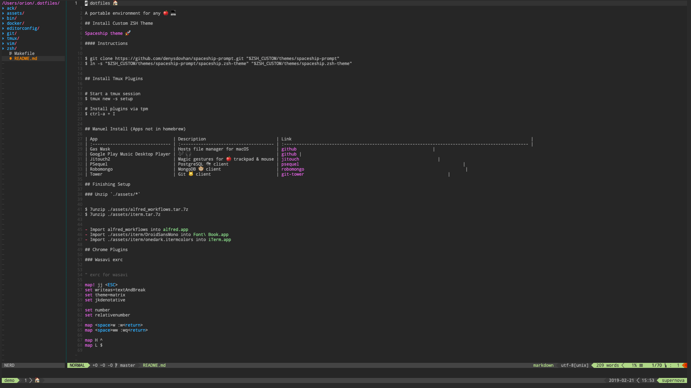

# dotfiles 🏠

A portable environment for any 🍎 💻

### Examples

vim example


## Install Custom ZSH Theme

[Spaceship theme 🚀](https://github.com/denysdovhan/spaceship-prompt)

#### Instructions

```shell
$ git clone https://github.com/denysdovhan/spaceship-prompt.git "$ZSH_CUSTOM/themes/spaceship-prompt"
$ ln -s "$ZSH_CUSTOM/themes/spaceship-prompt/spaceship.zsh-theme" "$ZSH_CUSTOM/themes/spaceship.zsh-theme"
```

## Install Tmux Plugins

```shell
# Start a tmux session
$ tmux new -s setup

# Install plugins via tpm
$ ctrl-a + I
```

## Manuel Install (Apps not in homebrew)

| App                              | Description                            | Link                                                                                               |
| :------------------------------- | :------------------------------------- | :------------------------------------------------------------------------------------------------- |
| Gas Mask                         | Hosts file manager for macOS           | [github](https://github.com/2ndalpha/gasmask)                                                      |
| Google Play Music Desktop Player | 🎶 🎧                                  | [github](https://github.com/MarshallOfSound/Google-Play-Music-Desktop-Player-UNOFFICIAL-/releases) |
| Jitouch2                         | Magic gestures for 🍎 trackpad & mouse | [jitouch](https://www.jitouch.com/download/)                                                       |
| PSequel                          | PostgreSQL 🐘 client                   | [psequel](http://www.psequel.com/)                                                                 |
| Robomongo                        | MongoDB 🐵 client                      | [robomongo](https://robomongo.org/)                                                                |
| Tower                            | Git 🐱 client                          | [git-tower](https://www.git-tower.com/mac)                                                         |

## Finishing Setup

### Unzip `./assets/*`

```shell
$ 7unzip ./assets/alfred_workflows.tar.7z
$ 7unzip ./assets/iterm.tar.7z
```

- Import alfred_workflows into `alfred.app`
- Import ./assets/iterm/DroidSansMono into `Font\ Book.app`
- Import ./assets/iterm/onedark.itermcolors into `iTerm.app`

## Chrome Plugins

### Wasavi exrc

```vim
" exrc for wasavi

map! jj <ESC>
set writeas=textAndBreak
set theme=matrix
set jkdenotative

set number
set relativenumber

map <space>w :w<return>
map <space>ww :wq<return>

map H ^
map L $
```
